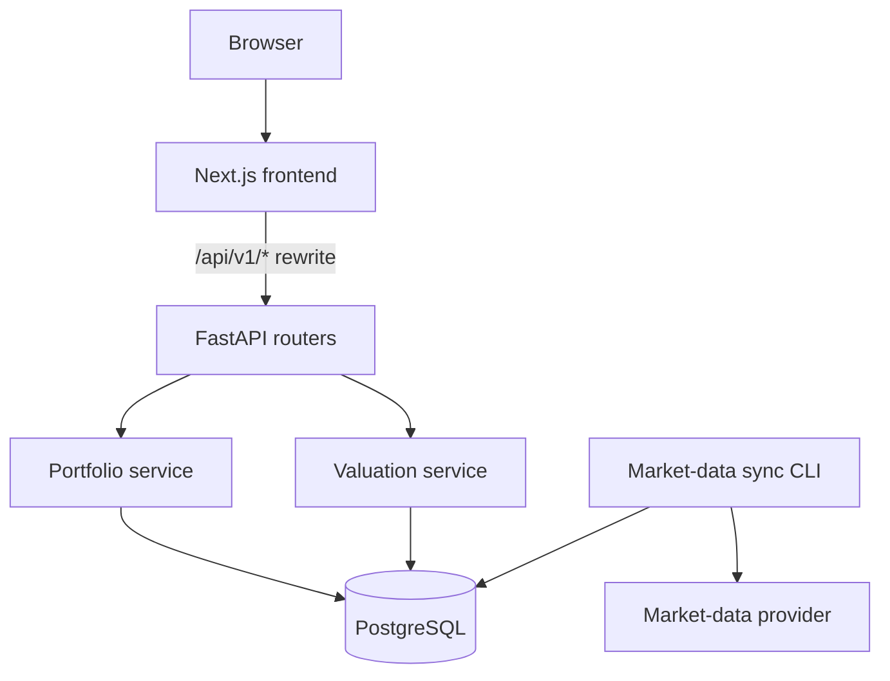
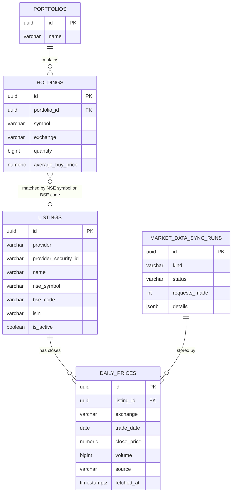

# Architecture

Portfolio Intelligence is a monorepo with a Next.js frontend, a FastAPI backend and a PostgreSQL database. Market data enters only through a separate sync process.

```
Frontend (Next.js)
    ↓  /api/v1/* forwarded by Next.js rewrites
FastAPI  (routing, request validation, error format)
    ↓
Portfolio service         Valuation service
    ↓                          ↓
PostgreSQL  ←──  Market-data sync (CLI)  ←──  Market-data provider (Indian API)
```



The portfolio and valuation APIs read the database only. **No web request ever calls the market-data provider**; prices are fetched by the sync process, validated and stored first.

## Components

| Layer | Location | Responsibility |
|---|---|---|
| Frontend | `frontend/src/app`, `frontend/src/components/portfolio` | Pages, forms, client-side checks, valuation display. Talks only to `/api/v1` on its own origin |
| Portfolio API | `backend/app/api/v1/portfolios.py` | Portfolios, holdings, CSV upload |
| Valuation API | `backend/app/api/v1/valuation.py` | `GET /api/v1/portfolios/{id}/valuation` |
| Market-data API | `backend/app/api/v1/market_data.py` | `GET /api/v1/market-data/status` (operational, no credentials) |
| Portfolio service | `backend/app/portfolios/` | Rules, CSV parsing, transactions for user-entered data |
| Valuation | `backend/app/valuation/` | `calculations.py` is pure `Decimal` arithmetic; `service.py` combines stored holdings with stored prices |
| Market data | `backend/app/market_data/` | Provider interface and adapter, response validation, trading calendar, request budget, repository, sync, CLI |

## Data model



### Portfolio → Holding

- A **portfolio** has zero or more **holdings**; `holdings.portfolio_id` references `portfolios.id` with `ON DELETE CASCADE`.
- `(portfolio_id, symbol, exchange)` is unique. Check constraints enforce positive quantity and price, `NSE`/`BSE` exchange and symbol format.
- Only user-provided data is stored here.

### Holding → Listing → Daily price

- `listings` is the application-owned security master loaded from the provider. `(provider, nse_symbol)` and `(provider, bse_code)` are unique; a code shared by several provider records is ambiguous and is not mapped.
- Holdings are **matched at read time**, not by a foreign key, so M2 data is unchanged: NSE holdings by NSE symbol, BSE holdings by BSE scrip code.
- `daily_prices` stores one reported closing price per `(listing_id, exchange, trade_date)`. `trade_date` is a `DATE` (the exchange trading day); `close_price` is `NUMERIC(18,4)`. Exchange is part of the key so BSE prices can be added later without a schema change.
- `market_data_sync_runs` records every sync and is the source of truth for monthly request accounting.
- Market value, P&L, returns and weights are **never stored**; they are calculated on every request.

## Request flows

**Manual entry and CSV import** are unchanged from Milestone 2: holdings are validated and saved in one transaction.

**Valuation** (`GET /api/v1/portfolios/{id}/valuation`):

1. Load the portfolio and its holdings.
2. Match each holding to a listing and read its two most recent NSE closes.
3. Classify each holding: VALUED (price is from the latest expected NSE session), STALE (older), UNPRICED (no listing, no NSE listing, or no price).
4. Calculate invested value, market value, P&L, return and weight with `Decimal`; unpriced holdings are excluded from market totals.
5. Return decimal strings rounded once (2 places, ROUND_HALF_UP) with freshness, source and methodology.

**Market-data sync** (CLI, not a web request):

1. `sync-listings` loads the provider's security list.
2. `sync-prices` takes a PostgreSQL advisory lock, plans requests for held NSE securities that lack the latest expected session, and checks the monthly request budget before every request.
3. The provider adapter throttles (≥ 1.1 s), retries only timeouts and 5xx (bounded), stops on 400/401/403/429, and validates every response.
4. Valid closes are upserted; the run and its counters are recorded.

See [market-data.md](market-data.md) for methodology, freshness rules and limitations.

## Replaceable provider

`MarketDataProvider` (`app/market_data/providers/base.py`) is the only contract between the sync and a vendor. Providers return provider-neutral records (`app/market_data/records.py`). Valuation, the schema, the API and the frontend never see a provider's response format, so replacing Indian API means adding one adapter and registering it.

## Deployment state (Milestone 3A)

| Connection | Local development | Production (Vercel) |
|---|---|---|
| Browser → Next.js | Yes | Yes |
| Next.js → FastAPI | Yes (`API_BASE_URL` defaults to `http://127.0.0.1:8000` in development) | **Not connected.** No backend is deployed |
| FastAPI → PostgreSQL | Yes (local PostgreSQL 16) | Not deployed |
| Sync → provider | Yes, when `INDIAN_API_KEY` is set in `backend/.env` | Not deployed; needs a scheduled job and a secret store |

In production the portfolio pages show that storage is unavailable; the valuation panel shows that valuation is unavailable. The local database is never exposed.

## Security notes

- Configuration and credentials come only from environment variables; `.env` files are git-ignored. `DATABASE_URL` and `INDIAN_API_KEY` are secret values that do not appear in reprs or logs.
- The provider key is used only by the backend sync, sent only in the `X-Api-Key` header to the configured `https://` host, never with redirects, and redacted from error messages. No endpoint returns it and no frontend code references it.
- Provider URLs are fixed by settings (must be `https://`); no endpoint accepts a URL or forwards requests to the provider.
- Provider responses are size-limited and parsed as data; nothing is executed.
- Errors use a fixed JSON shape; unexpected errors return a generic 500 and are logged server-side only.
- CSV uploads are parsed in memory, limited to 1 MB and never written to disk.
- There is no authentication yet; this is a demonstration MVP.

## Backend layout

```
backend/
  alembic.ini, migrations/        schema migrations (no credentials)
  app/
    main.py                       application factory
    core/                         settings, errors, upload size middleware
    db/                           declarative base, engine and sessions
    api/deps.py                   settings, session and clock dependencies
    api/v1/                       portfolios, valuation, market-data routers
    portfolios/                   models, rules, schemas, service, CSV, calculations
    valuation/                    calculations (pure), schemas, service
    market_data/
      providers/                  base protocol, Indian API adapter
      ingestion/sync.py           security-master and price sync
      calendar.py                 NSE session and freshness rules
      budget.py                   monthly request budget
      repository.py, service.py   database access and read-side services
      records.py, schemas.py      provider-neutral records, status response
      cli.py                      sync command line
  tests/                          unit, API, sync, migration tests; recorded provider fixtures
```
