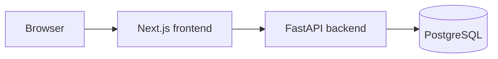

# Architecture

Portfolio Intelligence is a monorepo with two applications and a database.

```
Browser
  → Next.js   (frontend/)   user interface
  → FastAPI   (backend/)    API and, later, the portfolio analytics
  → PostgreSQL              portfolio data
```



## Components

| Layer | Technology | Responsibility |
|---|---|---|
| Browser | — | Renders the interface |
| Frontend | Next.js (App Router), TypeScript, Tailwind CSS | Pages, layout and, later, charts and forms |
| Backend | Python 3.12, FastAPI, Pydantic | HTTP API, validation and, later, the finance calculations |
| Database | PostgreSQL (local); Supabase PostgreSQL in production (planned) | Persistent storage |

Finance calculations will live in the Python backend, where pandas, NumPy and
SciPy are available. The frontend will only display results.

## Current state (Milestone 1)

Not every arrow in the diagram is connected yet.

| Connection | Status |
|---|---|
| Browser → Next.js | Live. The frontend is deployed on Vercel. |
| Next.js → FastAPI | Not connected yet. The frontend does not call the API. |
| FastAPI → PostgreSQL | Connectivity check only (`GET /health/db`). No tables exist. |
| FastAPI in production | Not deployed yet. The backend runs locally. |

## Backend layout

```
backend/app/
  main.py          application factory: middleware, error handlers, routers
  core/config.py   settings from environment variables
  core/errors.py   consistent JSON error responses
  api/health.py    GET /health, GET /health/db
  api/v1/router.py GET /api/v1; future finance modules are mounted here
  db/database.py   engine creation and connectivity check
  schemas/         Pydantic response models
```

New finance modules are added as a router under `app/api/v1/`, with their
logic in a separate package, without changing the existing structure.

## Configuration and secrets

- All configuration comes from environment variables (see `backend/.env.example`).
- Credentials are never hard-coded or committed; `.env` files are git-ignored.
- `DATABASE_URL` is held as a secret value so it does not appear in logs or error responses.
