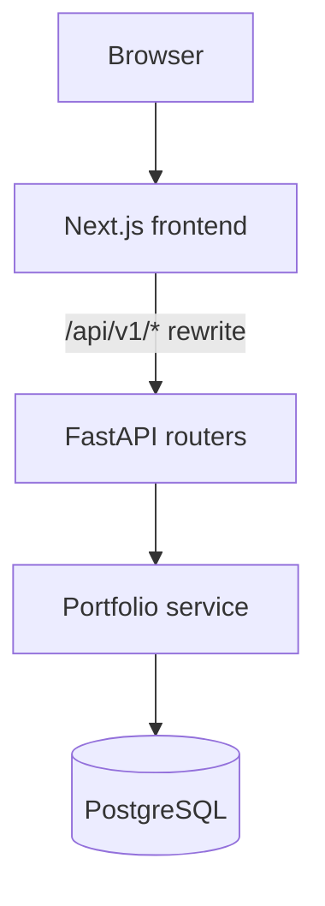
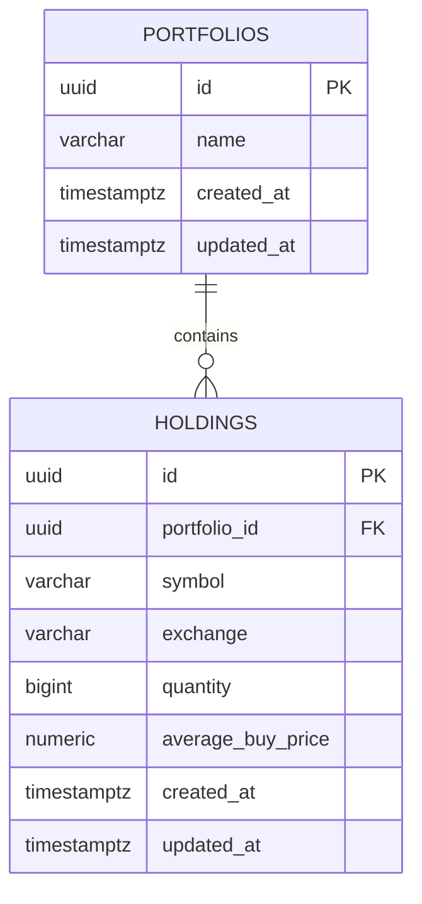

# Architecture

Portfolio Intelligence is a monorepo with a Next.js frontend, a FastAPI backend and a PostgreSQL database.

```
Frontend (Next.js)
    ↓  /api/v1/* forwarded by Next.js rewrites
FastAPI  (routing, request validation, error format)
    ↓
Portfolio service  (business rules, transactions)
    ↓
PostgreSQL  (portfolios, holdings)
```



## Components

| Layer | Location | Responsibility |
|---|---|---|
| Frontend | `frontend/src/app`, `frontend/src/components/portfolio` | Pages, forms, client-side checks for obvious errors, display. Talks only to `/api/v1` on its own origin |
| API | `backend/app/api/v1/portfolios.py` | HTTP endpoints, Pydantic request and response models, status codes, CSV upload handling |
| Validation rules | `backend/app/portfolios/rules.py` | One set of rules shared by the JSON API and CSV import |
| CSV parser | `backend/app/portfolios/csv_import.py` | Decodes and validates a CSV file in memory; returns holdings and row-level errors |
| Portfolio service | `backend/app/portfolios/service.py` | All reads and writes; transactions; maps database conflicts to domain errors |
| Calculations | `backend/app/portfolios/calculations.py` | Total invested capital with exact `Decimal` arithmetic |
| Models and migrations | `backend/app/portfolios/models.py`, `backend/migrations/` | SQLAlchemy models; Alembic migrations that create the schema |

The frontend forwards `/api/v1/*` to the backend using a Next.js rewrite configured by `API_BASE_URL`. The browser therefore never needs the backend's address, and no CORS configuration is involved.

## Data model: Portfolio → Holding



- A **portfolio** has zero or more **holdings**. A holding belongs to exactly one portfolio.
- `holdings.portfolio_id` references `portfolios.id` with `ON DELETE CASCADE`, so removing a portfolio removes its holdings.
- `(portfolio_id, symbol, exchange)` is unique: the same stock on the same exchange appears once per portfolio. The same symbol on NSE and on BSE are separate holdings.
- Check constraints enforce `quantity > 0`, `average_buy_price > 0`, `exchange IN ('NSE', 'BSE')` and the symbol format, in addition to API validation.
- Quantities are `BIGINT` (Indian equities trade in whole shares). Prices are `NUMERIC(14,4)` and are handled as `Decimal` in Python and as exact bigint units in the browser, never as floating point.
- Only user-provided data is stored. Market-dependent values (price, market value, returns, weights) are not persisted.

## Request flows

**Manual entry.** The browser collects holdings in memory, checks each one, and sends the full portfolio in a single `POST /api/v1/portfolios`. The service inserts the portfolio and all holdings in one transaction.

**CSV import.**

1. `POST /api/v1/portfolios/csv-preview` parses and validates the file and returns the rows and any errors. Nothing is saved.
2. After the user confirms, `POST /api/v1/portfolios/csv-import` sends the same file again. The server re-validates it; if any row is invalid it returns `422` with every problem and writes nothing. Otherwise the portfolio and holdings are created in one transaction.

**Display.** `GET /api/v1/portfolios/{id}` returns the portfolio, its holdings ordered by symbol, and `total_invested_capital`, computed on each request from the stored holdings.

## Deployment state (Milestone 2)

| Connection | Local development | Production (Vercel) |
|---|---|---|
| Browser → Next.js | Yes | Yes |
| Next.js → FastAPI | Yes (`API_BASE_URL` defaults to `http://127.0.0.1:8000` in development) | **Not connected.** No backend is deployed and `API_BASE_URL` is not set |
| FastAPI → PostgreSQL | Yes (local PostgreSQL 16) | Not deployed |

In production the portfolio pages detect that the API is unreachable and show a clear "storage isn't available" message instead of failing silently. The local database is never exposed to the internet.

## Security notes

- Configuration and credentials come only from environment variables; `.env` files are git-ignored. `DATABASE_URL` is held as a secret value so it does not appear in logs or reprs.
- Errors use a fixed JSON shape. Unexpected errors return a generic `500` message; stack traces, SQL and driver messages are only logged server-side, and connection failures are logged by exception type only.
- CSV files are read from the request's temporary upload storage into memory and parsed with Python's `csv` module as plain text: no formulas are evaluated and nothing is executed or written to disk. Uploads are limited to 1 MB (checked from `Content-Length` before the body is parsed, and again when reading) and to `.csv` files.
- Request bodies reject unknown fields. All database access uses SQLAlchemy with bound parameters.
- There is no authentication yet; this is a demonstration MVP.

## Backend layout

```
backend/
  alembic.ini                 migration settings (no credentials)
  migrations/                 Alembic environment and versioned migrations
  app/
    main.py                   application factory: middleware, error handlers, routers
    core/config.py            settings from environment variables
    core/errors.py            consistent JSON error responses
    core/middleware.py        upload size limit
    db/base.py                declarative base with constraint naming convention
    db/database.py            engine, sessions, connectivity check
    api/deps.py               settings and database session dependencies
    api/health.py             GET /health, GET /health/db
    api/v1/router.py          GET /api/v1; mounts module routers
    api/v1/portfolios.py      portfolio, holding and CSV endpoints
    portfolios/               models, rules, schemas, service, CSV parser, calculations
  tests/                      unit, API, CSV and migration tests
```

New finance modules follow the same pattern: a package under `app/` for models, rules and service, and a router under `app/api/v1/`.
